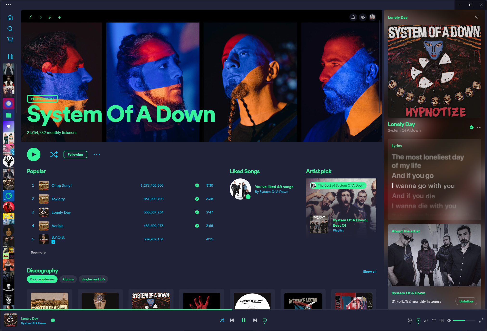

<!-- DO NOT CHANGE THIS -->
<p align="center">

</p>
<p>
Eldritch is a community-driven dark theme inspired by Lovecraftian horror. With tones from the dark abyss and an emphasis on green and blue, it caters to those who appreciate the darker side of life.
</p>

Main Theme repo can be found [here](https://github.com/eldritch-theme/eldritch)

### Showcase
<!-- Your screenshot should go here -->
<br/>

### Requirements
- [Spicetify](https://github.com/spicetify)

### Installation
#### Spicetify Marketplace installation
1. Install Spicetify with the Spicetify Marketplace app.
2. Install the `Sleek` theme through the Marketplace app, and change the color scheme to `Eldritch`.
#### Local installation
1. Instructions can be found here: https://github.com/spicetify/spicetify-themes
2. After installing the above you can use the following commands to activate:
```bash
spicetify config current_theme Sleek
spicetify config color_scheme Eldritch
spicetify apply
```

<!-- If you want to provide install from source options, you can use the following template: -->
<!-- ### Installation From Source -->
<!-- 1. Any instructions here -->
